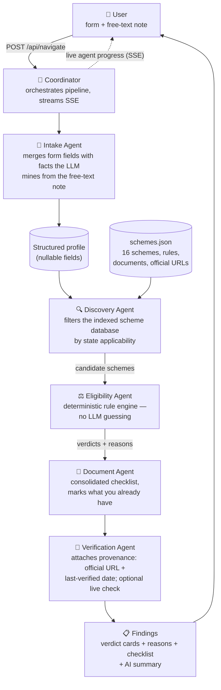
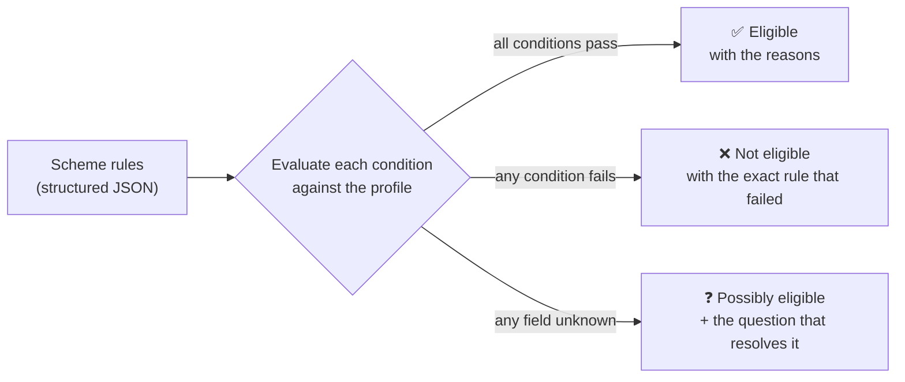

# 🇮🇳 AI Bureaucracy Navigator

**A multi-agent AI platform that helps people discover, understand, and apply for Indian government schemes, scholarships, and benefits — with explainable eligibility verdicts and links you can trust.**

> **Discover → Check Eligibility → Prepare Documents → Apply → Track → Resolve**

Describe your situation once. Five specialized agents find what you qualify for, explain *why*, build your document checklist, and hand you the verified official portal to apply on.


## How the agents work

A user submits a profile form (every field optional) plus a free-text note. The Coordinator runs five agents in sequence, streaming each agent's live progress to the browser over Server-Sent Events:



### How a verdict is decided

The LLM **never** decides eligibility. Each scheme's rules are structured JSON evaluated in code — consistent, explainable, and free to run. Unknown answers are never treated as "no":



### Where the LLM *is* used (optional, degrades gracefully)

| Task | Without API key | With API key (any OpenAI-compatible endpoint) |
|---|---|---|
| Free-text note → profile fields | note is saved, skipped | "*19yo girl from a farming family, 1.5L income*" → 8 structured fields |
| Results summary | deterministic template | warm 3-sentence natural summary |
| Eligibility decisions | **rule engine — always** | **rule engine — always** |
| Links shown to users | **curated DB — always** | **curated DB — always** |

## Screenshots

| Results with live agent panel | Scheme detail page |
|---|---|
|  |  |

## Design principles

1. **Rules, not guesses.** Eligibility comes from a deterministic rule engine (`backend/rules.py`). Every verdict carries human-readable reasons; nothing is a black box.
2. **The LLM never writes URLs.** Links come from a curated database with a `last_verified` date stamped by `scripts/check_links.py` — hallucinated government links are the fastest way to lose user trust.
3. **Unknown ≠ ineligible.** A blank profile field makes a scheme "possibly eligible" and tells the user exactly which answer would settle it.
4. **Honest by default.** Results are labeled indicative; final eligibility always rests with the concerned department against submitted documents.

## Architecture

```
frontend/  (vanilla HTML/CSS/JS, dark theme)
    index.html              landing page (public)
    signin.html             sign in / create account (public)
    app.html + app.js       the navigator app (session required)
    scheme.html             per-scheme detail page
    │  POST /api/navigate  →  text/event-stream (SSE)
backend/
    main.py                 FastAPI app (serves frontend + API)
    auth.py                 email/password auth — SQLite + PBKDF2 + cookie sessions
    models.py               UserProfile / Finding (pydantic)
    rules.py                deterministic eligibility rule engine + criteria describer
    llm.py                  optional OpenAI-compatible LLM layer
    agents/
        coordinator.py      pipeline orchestration + SSE
        intake.py  discovery.py  eligibility.py  documents.py  verification.py
    data/schemes.json       seed DB: 16 central schemes with rules + official URLs
scripts/check_links.py      link checker (keeps "verified <date>" honest)
```

## API

| Method | Endpoint | Auth | Purpose |
|---|---|---|---|
| POST | `/api/navigate` | session | run the agent pipeline (SSE stream) |
| GET | `/api/schemes` | public | scheme catalogue |
| GET | `/api/schemes/{id}` | public | full scheme record + plain-language criteria |
| POST | `/api/auth/register` | — | create account, sets session cookie |
| POST | `/api/auth/login` | — | sign in, sets session cookie |
| POST | `/api/auth/logout` | session | end session |
| GET | `/api/auth/me` | session | current user |
| GET | `/api/health` | public | liveness |

**Auth:** email/password with HttpOnly cookie sessions (7-day expiry). Users live in `backend/data/users.db` (SQLite, gitignored). PBKDF2-SHA256 with per-user salts; no external auth dependencies — swap in OAuth later without touching the rest of the app.

## Quick start

```bash
pip install -r requirements.txt
uvicorn backend.main:app --reload
# open http://localhost:8000
```

Works fully offline with no API key. Optional extras:

```bash
# enable free-text extraction + AI summary (any OpenAI-compatible endpoint, e.g. Groq)
export LLM_API_KEY=...
export LLM_BASE_URL=https://api.groq.com/openai/v1
export LLM_MODEL=llama-3.3-70b-versatile

# live-check official links during the Verification stage
export VERIFY_LINKS=1
```

Verify scheme links (run before demos; `--stamp` updates the verified dates):

```bash
python scripts/check_links.py --stamp
```

## Scheme database

16 central-government schemes across Education, Agriculture, Health, Housing, Pension, Insurance, Welfare, Livelihood, Savings, and Skill Development — including PM-KISAN, NSP scholarships (CSSS, Post-Matric SC/Minority, NMMSS), Ayushman Bharat PM-JAY, PMAY-Gramin, Ujjwala 2.0, Atal Pension Yojana, PM Vishwakarma, Sukanya Samriddhi, and NSAP pensions. Each record carries structured eligibility rules, required documents, apply route, and a live-verified official URL. The schema already supports state-level schemes (`"state": "Karnataka"`).

## Tech stack

| Layer | Choice | Why |
|---|---|---|
| Backend | FastAPI (Python) | async SSE streaming, pydantic validation |
| Agents | custom lightweight pipeline | deterministic orchestration, zero token cost for rules |
| LLM | any OpenAI-compatible endpoint | Groq / OpenAI / local — swappable via env vars |
| Data | JSON seed DB → SQLite (users) | zero-setup MVP; Postgres+pgvector is the upgrade path |
| Frontend | vanilla HTML/CSS/JS | no build step, SSE via fetch streams |

## Roadmap

- [ ] One-tap gap filling: answer a "possibly eligible" question and re-run instantly
- [ ] Voice intake via Whisper (speak your situation in any language)
- [ ] Vector search (pgvector) over scheme descriptions for fuzzy discovery
- [ ] Ingestion pipeline: crawl myScheme / NSP, LLM-extract rules JSON at ingestion, human review queue
- [ ] State-specific scheme packs
- [ ] Deadline tracking + reminders (Postgres + cron)
- [ ] DigiLocker integration — auto-verify issued documents, catch income/certificate mismatches before applying
- [ ] Resolution agent — RTI templates, grievance-portal (CPGRAMS) guidance
- [ ] WhatsApp bot interface

## Disclaimer

Results are **indicative**, based on self-declared information. Final eligibility is decided by the concerned department against submitted documents. Always confirm on the official portal linked with each scheme.
